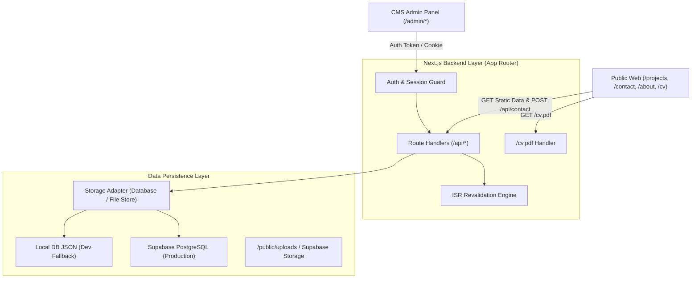

# Backend Contract & Implementation Plan
## Portfolio Website + CMS (Rangga Prasetya)

> **Dokumen Arsitektur & Kontrak API Backend**
> Mengacu pada: `PRD_Portfolio_CMS.md` dan standar `api-contract-guardian`.

---

## 1. Ringkasan Eksekutif & Arsitektur Backend

Sistem backend ini dibangun terintegrasi di dalam Next.js (App Router) menggunakan **Route Handlers** dan **Server Actions**. Backend bertindak sebagai single source of truth untuk:
1. **CMS Admin Panel**: Pengelolaan Projects (draft/publish, order, featured), Media Library (alt text enforcement), Resume PDF release, Owner Profile, Inquiries, dan Site Settings.
2. **Halaman Publik**: Mengambil data terpublikasi (SSG/ISR) dan menerima submisi formulir kontak yang terproteksi anti-spam.
3. **Database Layer**: Menggunakan layer repositori data modular yang mendukung **Supabase PostgreSQL** via connection string saat environment terpasang, dengan fallback **JSON/File DB persistent storage** otomatis selama tahap local development sehingga seluruh fitur CMS dapat berjalan langsung tanpa dependensi eksternal yang menghambat.



---

## 2. Standar Kontrak API (API Contract Guardian)

Semua endpoint backend mengikuti standar payload respons yang konsisten:

### 2.1 Format Respons Sukses
```json
{
  "success": true,
  "data": { ... },
  "meta": {
    "total": 12,
    "page": 1,
    "limit": 10,
    "timestamp": "2026-09-29T12:00:00.000Z"
  }
}
```

### 2.2 Format Respons Error
```json
{
  "success": false,
  "error": {
    "code": "VALIDATION_ERROR",
    "message": "Payload yang dikirim tidak valid.",
    "details": [
      {
        "field": "title",
        "message": "Title wajib diisi minimal 3 karakter."
      }
    ]
  }
}
```

### 2.3 Standar Kode Error
| Error Code | HTTP Status | Keterangan |
|---|---|---|
| `VALIDATION_ERROR` | 422 / 400 | Data input tidak lolos validasi skema Zod |
| `UNAUTHORIZED` | 401 | Kredensial tidak valid atau session cookie hilang |
| `FORBIDDEN` | 403 | Akses ke resource admin tanpa hak otorisasi |
| `NOT_FOUND` | 404 | Data entity atau project slug tidak ditemukan |
| `RATE_LIMIT_EXCEEDED`| 429 | Percobaan submit melebihi batas frekuensi |
| `INTERNAL_ERROR` | 500 | Kegagalan server atau storage internal |

---

## 3. Spesifikasi Endpoint API Detail

### 3.1 Autentikasi (`/api/auth`)

#### `POST /api/auth/login`
- **Tujuan**: Verifikasi kredensial admin dan inisialisasi session cookie.
- **Request Body**:
  ```json
  {
    "email": "admin@rangga.dev",
    "password": "secure_password"
  }
  ```
- **Response (200 OK)**:
  ```json
  {
    "success": true,
    "data": {
      "user": {
        "email": "admin@rangga.dev",
        "name": "Rangga Prasetya",
        "role": "admin"
      },
      "token": "sess_token_string"
    }
  }
  ```
- **Headers**: Menyetel cookie `Set-Cookie: admin_session=...; HttpOnly; SameSite=Lax; Path=/`

#### `GET /api/auth/me`
- **Tujuan**: Memeriksa validitas session user yang sedang aktif.

#### `POST /api/auth/logout`
- **Tujuan**: Menghapus session cookie dan logout.

---

### 3.2 Projects Management (`/api/projects`)

#### `GET /api/projects`
- **Akses**: Publik & Admin
- **Query Parameters**:
  - `status`: `published` | `draft` | `all` (default: `published` untuk publik, `all` untuk admin)
  - `category`: `all` | `fullstack` | `frontend` | `backend` | `iot`
  - `featured`: `true` | `false`
  - `search`: string pencarian pada judul/summary/tech
- **Response (200 OK)**:
  ```json
  {
    "success": true,
    "data": [
      {
        "id": "proj-1",
        "title": "Angkot To School (DISHUB Kota Bandung)",
        "slug": "angkot-to-school",
        "summary": "Real-time public transit tracking...",
        "coverImage": "/images/angkot_to_school-63d994.png",
        "coverAlt": "Angkot To School public transit tracking dashboard preview",
        "category": "fullstack",
        "categoryDisplay": "WEB APPLICATION",
        "role": "Lead Fullstack & IoT Architect",
        "year": "2024",
        "clientName": "DISHUB Kota Bandung",
        "clientType": "Government / Municipal Agency",
        "techStack": ["React", "Leaflet.js", "Node.js", "Express", "PostgreSQL", "WebSockets"],
        "liveUrl": "https://angkot-school.bandung.go.id",
        "repoUrl": "https://github.com/ranggaprasetya/angkot-school",
        "problem": "...",
        "solution": "...",
        "result": "...",
        "metrics": [
          { "id": "m1", "label": "Active Daily Students", "value": "12,400+" }
        ],
        "gallery": ["/images/angkot_detail_hero-21d03b.png"],
        "featured": true,
        "order": 1,
        "status": "published",
        "updatedAt": "2024-11-20"
      }
    ],
    "meta": { "total": 6 }
  }
  ```

#### `GET /api/projects/[id_or_slug]`
- **Akses**: Publik & Admin (Slug atau ID)
- **Response (200 OK)**: Single project detail atau 404 jika tidak ditemukan.

#### `POST /api/projects`
- **Akses**: Admin Only (dilindungi cookie auth)
- **Validation Schema (Zod)**:
  - `title`: string min 3 char (wajib)
  - `slug`: string slug format (unik, wajib)
  - `summary`: string max 160 char (wajib)
  - `coverImage`: string URL (wajib)
  - `coverAlt`: string min 3 char (wajib per PRD FR-6)
  - `category`: enum (`fullstack`, `frontend`, `backend`, `iot`)
  - `status`: enum (`published`, `draft`)
  - `techStack`: array of strings
- **Side Effect**: Memanggil hook revalidasi otomatis untuk `/`, `/projects`, dan `/projects/[slug]`.

#### `PUT /api/projects/[id]`
- **Akses**: Admin Only
- **Tujuan**: Memperbarui project secara parsial atau penuh.

#### `DELETE /api/projects/[id]`
- **Akses**: Admin Only
- **Tujuan**: Menghapus project secara permanen.

---

### 3.3 Media Library (`/api/media`)

#### `GET /api/media`
- **Akses**: Admin Only
- **Response (200 OK)**:
  ```json
  {
    "success": true,
    "data": [
      {
        "id": "med-1",
        "fileName": "angkot_to_school-63d994.png",
        "url": "/images/angkot_to_school-63d994.png",
        "size": "194 KB",
        "dimensions": "1280x720",
        "alt": "Angkot To School public transit tracking dashboard preview",
        "caption": "Hero cover image for Angkot To School project",
        "createdAt": "2024-11-10"
      }
    ]
  }
  ```

#### `POST /api/media`
- **Akses**: Admin Only
- **Payload**: FormData (`file`, `alt` [wajib], `caption` [opsional])
- **Aturan**: Alt text wajib diisi; file gambar disimpan ke direktori `/public/uploads/` (atau storage S3 Supabase jika terkonfigurasi).

#### `PUT /api/media/[id]`
- **Akses**: Admin Only
- **Payload**: `{ "alt": string, "caption": string }`

#### `DELETE /api/media/[id]`
- **Akses**: Admin Only

---

### 3.4 Resume Management (`/api/resume` & `/cv.pdf`)

#### `GET /api/resume`
- **Tujuan**: Mengambil metadata file CV aktif (versi, tanggal rilis, ukuran file).

#### `PUT /api/resume`
- **Akses**: Admin Only
- **Payload**: `{ "versionLabel": "v2.5", "fileName": "CV_Rangga_Prasetya.pdf" }`
- **Side Effect**: Memperbarui file fisik dan metadata `/cv.pdf`.

#### `GET /cv.pdf`
- **Akses**: Publik
- **Tujuan**: Menghidangkan file PDF resmi dengan header:
  - `Content-Disposition: inline; filename="CV_Rangga_Prasetya.pdf"`
  - `Content-Type: application/pdf`

---

### 3.5 Owner Profile & Site Settings (`/api/profile`, `/api/settings`)

#### `GET /api/profile` & `PUT /api/profile`
- Mengambil dan memperbarui nama, headline, bio, avatar, status ketersediaan, kontak, dan tautan sosial.

#### `GET /api/settings` & `PUT /api/settings`
- Mengambil dan memperbarui domain URL, SEO meta default, open graph card, dan email kontak.

---

### 3.6 Inquiries & Form Kontak (`/api/contact` & `/api/inquiries`)

#### `POST /api/contact` (Public Endpoint)
- **Akses**: Publik
- **Validasi Input**:
  - `name`: string (2-100 char)
  - `email`: valid email
  - `subject`: string (3-150 char)
  - `message`: string (10-2000 char)
  - `honeypot`: string (harus kosong; jika terisi maka bot spam langsung ditolak)
- **Rate Limit**: Maksimal 5 permintaan per 10 menit per IP.
- **Side Effect**: Menyimpan ke koleksi `Inquiries` dengan status `"new"`.

#### `GET /api/inquiries`
- **Akses**: Admin Only
- **Response**: Daftar semua pesan yang masuk.

#### `PATCH /api/inquiries/[id]`
- **Akses**: Admin Only
- **Payload**: `{ "status": "read" | "replied" }`

#### `DELETE /api/inquiries/[id]`
- **Akses**: Admin Only
- **Tujuan**: Menghapus pesan inquiry.

---

### 3.7 ISR Revalidation Hook (`/api/revalidate`)

#### `POST /api/revalidate`
- **Akses**: Internal Backend & Admin
- **Payload**: `{ "path": "/projects", "secret": "..." }`
- **Tujuan**: Memanggil `revalidatePath` untuk memperbarui cache CDN seketika saat ada perubahan konten di CMS (PRD FR-5).

---

## 4. Rencana Implementasi Bertahap (Implementation Plan)

### Fase 1: Data Storage & Model Layer
- [x] Definisikan TypeScript interfaces (`src/types/index.ts`).
- [x] Buat file persistent storage engine (`src/lib/db.ts`) yang membaca dan menulis state ke `data/db.json` dengan seed data awal, serta siap beralih ke Supabase PostgreSQL saat `DATABASE_URL` tersedia.
- [x] Buat skema validasi Zod DTO (`src/lib/validations/index.ts`).
- [x] Buat standard response helper (`src/lib/api-response.ts`).

### Fase 2: Route Handlers Implementation
- [x] Implementasikan endpoint Auth (`/api/auth/login`, `/api/auth/me`, `/api/auth/logout`) dengan session cookies.
- [x] Implementasikan endpoint Projects CRUD (`/api/projects`, `/api/projects/[id]`) dengan ISR revalidation hook.
- [x] Implementasikan endpoint Media Library (`/api/media`, `/api/media/[id]`) dengan multipart upload dan alt text mandatory check.
- [x] Implementasikan endpoint Resume (`/api/resume`) dengan PDF file handler dan `/cv.pdf` endpoint (RFC compliant inline disposition).
- [x] Implementasikan endpoint Profile & Settings (`/api/profile`, `/api/settings`).
- [x] Implementasikan endpoint Contact & Inquiries (`/api/contact`, `/api/inquiries`, `/api/inquiries/[id]`) dengan bot honeypot detection.
- [x] Implementasikan endpoint ISR Revalidation (`/api/revalidate`).

### Fase 3: Integrasi Frontend-to-Backend
- [x] Modifikasi `PortfolioContext` untuk memanggil API backend (`/api/*`) dengan optimistic UI update dan sinkronisasi server data.
- [x] Hubungkan form kontak publik (`/contact`) langsung ke `POST /api/contact` dengan validasi Zod.
- [x] Hubungkan seluruh modul CMS Admin (Projects Editor, Media Library, Resume, Profile, Settings, Inbox) ke masing-masing endpoint backend.

### Fase 4: Pengujian & Validasi
- [x] Uji validasi payload Zod (bad request handling, 422 error details).
- [x] Uji alur Create -> Edit -> Publish -> Revalidate project (Status 201, 200, 200).
- [x] Uji pengiriman formulir kontak (`POST /api/contact` -> 201) dan verifikasi muncul di Admin Inbox (`GET /api/inquiries`).
- [x] Uji pengunduhan file `/cv.pdf` dan pastikan header `Content-Disposition: inline; filename="CV_Rangga_Prasetya.pdf"`.
- [x] Uji typecheck `npx tsc --noEmit` (Exit code: 0).

